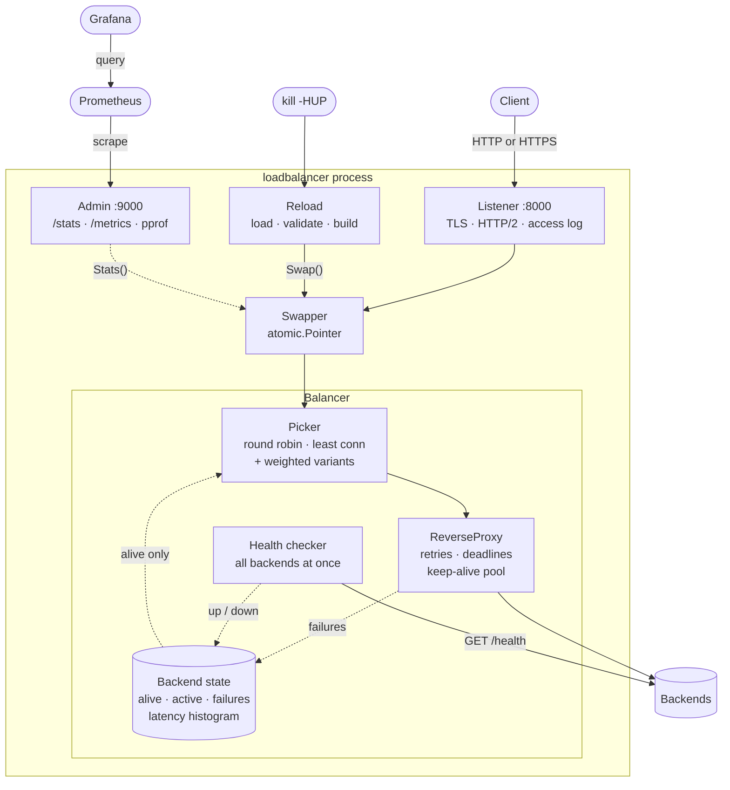

# loadbalancer

[](https://github.com/francisco3ferraz/loadbalancer/actions/workflows/ci.yml)

An HTTP (layer 7) load balancer in Go, using only the standard library plus a
YAML parser. Four algorithms, active and passive health checks, retries, TLS
with HTTP/2, and config reload without dropping a request. About 60,000
requests/sec on a laptop, with latency histograms in Prometheus, a Grafana
dashboard and a 7.5MB Docker image.



A request goes through the [access log](#access-log), the swapper (which a
[reload](#reloading-the-config) points at a new balancer), and an
[algorithm](#algorithms) that only sees live backends; on failure it's
[retried or answered with a 502, 503 or 504](#how-failures-are-handled). Each
feature exists to handle a real failure mode, and each is covered by tests.


*The Grafana dashboard from `docker compose up`, under load. Each fake backend
has its own latency, with backend2 the slowest. When it was stopped for 45
seconds, one failed attempt took it out of rotation, traffic shifted to the
other two, and a health check brought it back.*

## Features

- **Four algorithms:** round robin, least connections, weighted round robin
  (nginx's smooth variant), and weighted least connections.
- **Health checks:** active checks on a configurable path, run on every
  backend at once so hanging backends don't slow down the rest, plus passive
  detection when real requests fail.
- **Failure handling:** a backend that refuses connections is marked down
  immediately; one that times out is marked down after several failures in a
  row, so one slow URL can't take healthy servers out of rotation.
- **Retries:** failed `GET`, `HEAD` and `OPTIONS` requests without a body are
  retried on another backend. Other requests are never retried, since repeating
  them could have side effects. Optionally, so are answers of `502` or `503`.
- **Timeouts:** per attempt, per request across all retries (giving a `504`),
  and on the server itself against slow clients.
- **Long-lived connections:** WebSockets (and any other `Upgrade`) and
  server-sent events stay open for as long as both ends want, exempt from the
  request deadline and the server's write timeout.
- **Request size limit:** bodies over `max_body_size` get a `413`, whether or
  not the client declares the size up front, and backends aren't blamed.
- **Graceful shutdown:** on Ctrl+C or `SIGTERM`, requests in progress finish
  before the process exits. A second Ctrl+C exits immediately. Event streams
  never finish on their own, so they hold the shutdown for its full limit
  (`request_timeout` + 5s) and are then cut; WebSockets are cut when the
  process exits.
- **Config reload:** `kill -HUP <pid>` applies an edited config without
  closing the port or failing a request; an invalid config is rejected and
  the old one keeps running.
- **TLS termination:** with a certificate and key, clients connect over HTTPS,
  and HTTP/2 if they support it; backends are still reached over plain HTTP.
  A reload picks up a renewed certificate without closing a connection.
- **Forwarding headers:** backends get `X-Forwarded-For`, `X-Forwarded-Host`
  and `X-Forwarded-Proto`, set by the load balancer and never copied from the
  client, so they can't be forged. The client's `Host` is kept.
- **Access log:** one structured line per request on stdout, with the backend
  that served it and how many were tried; errors stay on stderr.
- **Stats and metrics:** an optional admin server with a JSON `/stats`
  endpoint, Prometheus metrics on `/metrics` including a latency histogram
  per backend, and `pprof` profiles; Docker Compose adds Prometheus and a
  Grafana dashboard.

## Quick start

Requires Go 1.27.1 or later (the version in `go.mod`).

```sh
# Terminal 1: start three fake backends on ports 8080-8082
scripts/run-backends.sh

# Terminal 2: start the load balancer with ./config.yaml
go run ./cmd/loadbalancer

# Terminal 3: send some requests
for i in 1 2 3 4; do curl localhost:8000; done   # :8080 :8081 :8082 :8080
curl 127.0.0.1:9000/stats
```

Use a different config file with `-config path/to/file.yaml`.

### With Docker

```sh
docker compose up --build
docker compose cp loadbalancer:/etc/loadbalancer/certs/cert.pem .
curl --cacert cert.pem https://localhost:8000   # backend1, backend2, backend3 in turn
curl 127.0.0.1:9000/stats
docker compose stop backend2  # traffic goes to the other two
```

This starts the load balancer, three fake backends, Prometheus and Grafana,
using [`docker/config.yaml`](docker/config.yaml). The backends answer with
different latencies (`-delay` and `-jitter`), so they can be told apart.
Inside a container `127.0.0.1` is that container, so the backends are reached
by their Compose service names, and the admin server listens on all
interfaces but is published only on the host's loopback.

The Grafana dashboard is at <http://127.0.0.1:3000>. Give it some traffic to
show:

```sh
wrk -t2 -c8 -d5m https://localhost:8000/   # or, without wrk:
while :; do curl -so /dev/null --cacert cert.pem https://localhost:8000; done
```

Prometheus scrapes `/metrics` every 5 seconds; its UI is at
<http://127.0.0.1:9090>. Grafana's data source and dashboard are loaded from
[`docker/grafana`](docker/grafana); anyone who can reach it may view them,
and logging in as `admin`/`admin` allows editing, which isn't saved back to
the file.

The image is built in two stages: the Go toolchain compiles static binaries,
and only those are copied into a distroless image (7.5MB to download, 17MB
unpacked) that runs as a non-root user. It holds both programs: `/loadbalancer` by default, reading
`/etc/loadbalancer/config.yaml`, and `/fakebackend` for the backends.
`docker stop` sends `SIGTERM`, so requests in progress finish first; Compose
waits up to 20s, above the load balancer's 15s drain.

The load balancer serves HTTPS with a self-signed certificate for
`localhost`, which a one-off `certs` service makes on the first run and keeps
in a volume, so it survives restarts; `docker compose down -v` deletes it and
the next `up` makes a new one. The admin server and the backends stay on
plain HTTP. `docker compose kill -s HUP loadbalancer` reloads the config and
certificate.

## Configuration

Settings come from a YAML file. Only `backends` is required. The shipped
[`config.yaml`](config.yaml) documents every setting and its default.

| Setting | Default | Meaning |
|---|---|---|
| `listen` | `:8000` | Address the load balancer listens on |
| `algorithm` | `round-robin` | See [Algorithms](#algorithms) |
| `backends` | (required) | Backend URLs, or objects with `url` and `weight` |
| `health_path` | `/health` | Path requested by health checks; `200` means healthy |
| `health_check_interval` | `5s` | How often each backend is checked |
| `attempt_timeout` | `5s` | How long one backend has to start answering |
| `request_timeout` | `10s` | Total time for a request, across all retries; not applied to upgrades or event streams |
| `max_failures` | `3` | Failures in a row that mark a backend down |
| `access_log` | `true` | Log one line per request to stdout |
| `max_body_size` | `1MB` | Largest request body accepted; bytes, or with `KB`, `MB` or `GB` |
| `admin_listen` | off | Address of the admin server, e.g. `127.0.0.1:9000` |
| `tls_cert`, `tls_key` | off | PEM files of the certificate and private key; set both to serve HTTPS |

Backends can be plain URLs or carry a weight, and the two forms can be mixed:

```yaml
backends:
  - http://127.0.0.1:8080          # weight 1
  - url: http://127.0.0.1:8081
    weight: 3
```

The config is checked at startup: unknown keys (such as a typo like
`algoritm`), invalid durations or sizes, negative values and unknown algorithms
are reported as errors, and the load balancer doesn't start.

## TLS

With `tls_cert` and `tls_key` set, the load balancer terminates TLS: it does
the handshake and decrypts, then proxies plain HTTP to the backends, so only
it holds the private key. HTTP/2 is negotiated during the handshake (ALPN)
with clients that offer it, others get HTTP/1.1. Plain HTTP sent to the TLS
port gets a `400`.

```sh
# A self-signed certificate for trying it out, writing cert.pem and key.pem
go run "$(go env GOROOT)/src/crypto/tls/generate_cert.go" --host localhost
# Then add tls_cert: cert.pem and tls_key: key.pem to config.yaml and start
curl -v --cacert cert.pem https://localhost:8000   # "ALPN: server accepted h2"
```

Backends see `X-Forwarded-Proto: https`. Certificates expire, so a reload
(`kill -HUP`) rereads both files, and new connections get the new
certificate while open ones keep theirs. A certificate that can't be loaded
fails startup, or is rejected on reload with the old one kept serving.

HTTP/2 has no `Upgrade`, and Go's server doesn't offer WebSockets over HTTP/2
(RFC 8441), so clients open a separate HTTP/1.1 connection for a WebSocket,
which is proxied as without TLS. Event streams work over both.

## Algorithms

| `algorithm` | Picks | Good for |
|---|---|---|
| `round-robin` | Each backend in turn | Similar backends and similar requests |
| `least-connections` | The backend with the fewest requests in progress | Requests with very different durations |
| `weighted-round-robin` | In proportion to `weight`, interleaved (`A A B A C A A` for weights 5, 1, 1) | Backends of different sizes |
| `weighted-least-connections` | The fewest requests in progress per unit of weight | Different sizes *and* uneven request durations |

Backends that are down, or already tried for the current request, are left out
before an algorithm chooses, so traffic is shared only among healthy backends.

## How failures are handled

For each request, the load balancer tries backends one at a time:

1. **Success:** the response is passed to the client, and the backend's
   failure count resets.
2. **Connection refused:** the backend is marked down immediately.
3. **Timeout or other error:** the backend's failure count goes up. It's marked
   down when the count reaches `max_failures`.
4. **Retry:** for `GET`, `HEAD` and `OPTIONS` requests without a body, the next
   backend is tried. Otherwise the client gets a `502`.
5. **`502` or `503` answer:** with `retry_unavailable: true`, these requests
   are also retried on the next backend, and the backend isn't counted as
   failing; health checks decide whether it's down. The last backend's answer
   is passed to the client unchanged, `Retry-After` included. The response
   can't be retried once it has started reaching the client, so the decision
   is made as soon as the backend's headers arrive.

The client's response depends on why the request couldn't be served:

| Status | Meaning |
|---|---|
| `413 Content Too Large` | The request body was over `max_body_size` |
| `502 Bad Gateway` | A backend was tried and failed |
| `503 Service Unavailable` | No backend was up, so none was tried (or a backend's own `503`) |
| `504 Gateway Timeout` | `request_timeout` ran out |

If the client disconnects, sends a body over `max_body_size`, or
`request_timeout` runs out, the backend isn't blamed: none of these counts as
a backend failure. Backends marked down come back when their health check
succeeds again.

## Access log

Every request gets one line on stdout once it's finished, in `log/slog`'s
key=value format:

```
time=... level=INFO msg=request method=GET path=/status/404 status=404 bytes=14 duration=670µs client=[::1]:37894 backend=localhost:18081 attempts=2
```

`backend` is the last backend tried and `attempts` how many were, so retries
show up as `attempts=2` or more. The query string is left out, since it can
carry tokens. `status=0` means no response was sent because the client gave
up first. WebSockets are logged as `101` when they close, so their `duration`
is how long the connection was open. Set `access_log: false` to turn it off.

## Admin server

With `admin_listen` set, `GET /stats` returns a snapshot of every backend:

```json
{
  "backends": [
    {"url": "http://127.0.0.1:8080", "alive": true, "active": 2, "failures": 0, "requests": 1532, "total_failures": 4},
    {"url": "http://127.0.0.1:8081", "alive": false, "active": 0, "failures": 3, "requests": 610, "total_failures": 27}
  ]
}
```

`active` is requests in progress, `failures` is failures in a row,
`requests` is attempts served in total, and `total_failures` is failures in
total. Failures the backend isn't blamed for, such as a client giving up or
the request deadline running out, aren't counted.

`GET /metrics` serves the same numbers in Prometheus' text format, with a
`backend` label holding the backend's URL:

| Metric | Type | Meaning |
|---|---|---|
| `loadbalancer_backend_up` | gauge | `1` if the backend is alive, `0` if down |
| `loadbalancer_backend_active_requests` | gauge | Requests in progress |
| `loadbalancer_backend_requests_total` | counter | Attempts sent to the backend |
| `loadbalancer_backend_consecutive_failures` | gauge | Failures in a row |
| `loadbalancer_backend_failures_total` | counter | Failures in total |
| `loadbalancer_backend_latency_seconds` | histogram | Time from sending a request until the backend's response headers arrived |

Latency is measured per attempt, up to the response headers rather than the
end of the body, so an event stream or a client reading slowly doesn't make a
backend look slow. Every answer counts, a `503` included; failed attempts
don't, since they're in `failures_total`. Buckets go from 1ms to 10s. The
99th percentile per backend, over the last minute:

```promql
histogram_quantile(0.99, sum by (backend, le) (rate(loadbalancer_backend_latency_seconds_bucket[1m])))
```

The histogram is a counter per bucket, updated with two atomic adds per
response; the benchmark showed no difference beyond noise. A percentile is
estimated from the buckets by Prometheus, only as precisely as the bucket it
falls in. It's left out of `/stats`.

A config reload starts the counters from zero, which `rate()` handles like a
restart. A backend removed by a reload stops being reported.

The admin server also serves Go's runtime profiles under `/debug/pprof/` (see
[Performance](#performance)). Both show internal details, so it runs on a
separate port, which should stay on a loopback address.

## Reloading the config

Edit the config file, then send the process `SIGHUP`:

```sh
kill -HUP <pid>
```

The new config is checked first. If it's valid, new requests go to a balancer
built from it, while requests already in progress finish on the old one, so
none fail. If it isn't, the error is logged and the old config keeps running.

A reload starts afresh: every backend begins alive, with its failure count and
`/stats` counters at zero, and health checks restart on the new interval.

Some settings are fixed once the process has started, so a reload that
changes them is rejected as a whole: `listen`, `admin_listen`, `access_log`,
turning TLS on or off (changing the certificate is fine), and raising
`request_timeout` above its value at startup (the server's own timeouts were
sized from it). Restart to change these.

## Testing

```sh
go test -race ./...
```

The suite runs in a few seconds. CI runs it on every push, along with
`gofmt`, `go vet` and `go mod tidy` checks.

For manual testing, `cmd/fakebackend` is a backend whose failures you control:

```sh
go run ./cmd/fakebackend -port 8081 -delay 30s        # hangs: tests timeouts
go run ./cmd/fakebackend -port 8081 -error-rate 0.2   # 20% of requests return 500
go run ./cmd/fakebackend -port 8081 -jitter 10ms      # random latency, averaging 10ms, with a long tail
curl -X POST localhost:8081/admin/health/down          # fail health checks, keep serving
curl 'localhost:8000/slow?d=3s'                         # a slow request through the balancer
curl -N localhost:8000/stream                           # server-sent events, one a second
```

The fake backend's `/ws` accepts a plain `Connection: Upgrade` and echoes back
whatever it receives, which is all a proxy sees of a WebSocket.

`scripts/run-backends.sh` starts several at once (`BACKEND_FLAGS` passes flags
to all of them), and prints each PID so you can kill one to simulate a crash.

## Project layout

```
cmd/loadbalancer     the program: loads config, starts the servers, TLS,
                     reloads, shuts down
cmd/fakebackend      a controllable backend for testing
internal/balancer    proxying, retries, timeouts, health checks, algorithms,
                     stats, latency histograms, access log
internal/config      the YAML file format
internal/admin       the /stats, /metrics and /debug/pprof endpoints
scripts/             run-backends.sh, bench.sh
docker/              configs used by docker-compose.yml, Grafana's included
docs/                the dashboard screenshot
```

## Performance

Measured with [`wrk`](https://github.com/wg/wrk) on one laptop (AMD Ryzen 5
5600H, 6 cores / 12 threads, Linux 7.2, Go 1.27.1), with the client, the load
balancer and three fake backends all on the same machine. Backends answer at
once with a few bytes, so these numbers show the load balancer's own cost, not
a realistic workload.

`wrk -t4 -c50 -d30s`, median of 3 runs, access log off:

| Setup | Requests/sec | p50 | p99 |
|---|---|---|---|
| Direct to one backend | 243,251 | 134µs | 1.18ms |
| Load balancer, round-robin | 60,900 | 677µs | 2.55ms |
| Load balancer, least-connections | 61,297 | 667µs | 2.38ms |
| Load balancer, weighted-round-robin | 60,885 | 677µs | 2.56ms |
| Load balancer, weighted-least-connections | 59,528 | 686µs | 2.50ms |

To reproduce (requires `wrk`; `RUNS`, `DURATION`, `CONNECTIONS` and `THREADS`
can be overridden):

```sh
scripts/bench.sh
```

What changed the numbers, each measured on its own with round robin:

| Change | Requests/sec | p50 | Gain |
|---|---|---|---|
| Go's defaults | 21,086 | 2.15ms | |
| Keep up to 100 idle connections per backend | 31,276 | 1.43ms | +48% |
| Reuse response copy buffers (`ReverseProxy.BufferPool`) | 52,479 | 778µs | +68% |
| `GOGC=400` | 59,612 | 692µs | +14% |
| Profile-guided optimization (`default.pgo`) | 60,292 | 682µs | +1% |

- **Connection reuse.** Go's default transport keeps only 2 idle connections
  per backend, so under load most requests opened a new one, and about 42,000
  sockets piled up in `TIME_WAIT`.
- **Buffer reuse.** Without a pool, `ReverseProxy` allocates a 32KB buffer to
  copy every response body: about 1GB/s of garbage at 30,000 requests/sec,
  which the allocator has to zero and the garbage collector has to free.
- **`GOGC=400`** lets the heap grow to five times its live size between
  collections instead of twice. Memory under load went from about 25MB to
  43MB. The program sets it unless the `GOGC` environment variable is set.
- **PGO** uses `cmd/loadbalancer/default.pgo`, a CPU profile taken under this
  benchmark, which `go build` picks up automatically. The gain is small but
  repeated across runs: most of the time is spent in the kernel and runtime,
  which the profile can't optimize.

What's left is the cost of a second hop. Each request is parsed twice and
crosses four sockets instead of two: a CPU profile puts about a third of the
load balancer's time in socket reads and writes, and the load balancer's own
code at about 5%. All processes share 12 threads, so the machine is
saturated, which widens the gap. The algorithms cost the same within noise.

wrk is closed-loop: each connection waits for a response before sending the
next request, so a stall delays the requests that would have measured it, and
p99 can look better than it is (coordinated omission).

To profile, set `admin_listen` and, under load:

```sh
go tool pprof -http=: http://127.0.0.1:9000/debug/pprof/profile?seconds=20
```

## Design decisions

- **Only safe requests are retried.** Repeating a `POST` could charge someone
  twice. Requests with a body aren't retried either, because the body is used
  up by the first attempt.
- **A timeout isn't proof a backend is dead.** Refused connections are, so they
  mark a backend down at once; timeouts need several in a row.
- **One total deadline per request.** Without it, retries would multiply the
  waiting time: 3 backends × a 5s timeout would be 15s.
- **Long-lived connections are recognised, not configured.** An upgrade is
  known from its request (`Connection: Upgrade` plus an `Upgrade` header), so
  it never gets a deadline. An event stream is only known from its response
  (`Content-Type: text/event-stream`), so the deadline is a timer that's
  stopped when such a response arrives, rather than a fixed `WithTimeout`.
- **Load is counted locally.** Least connections uses the load balancer's own
  count of requests in progress, as nginx, HAProxy and Envoy do. Each instance
  therefore sees only its own traffic.
- **The file format is separate from the internal config,** so either can
  change without breaking the other. Older files listing backends as plain URLs
  keep working.
- **Bad configuration fails at startup,** never while serving traffic; a bad
  config on reload is rejected and the old one keeps serving.

## License

[MIT](LICENSE)
